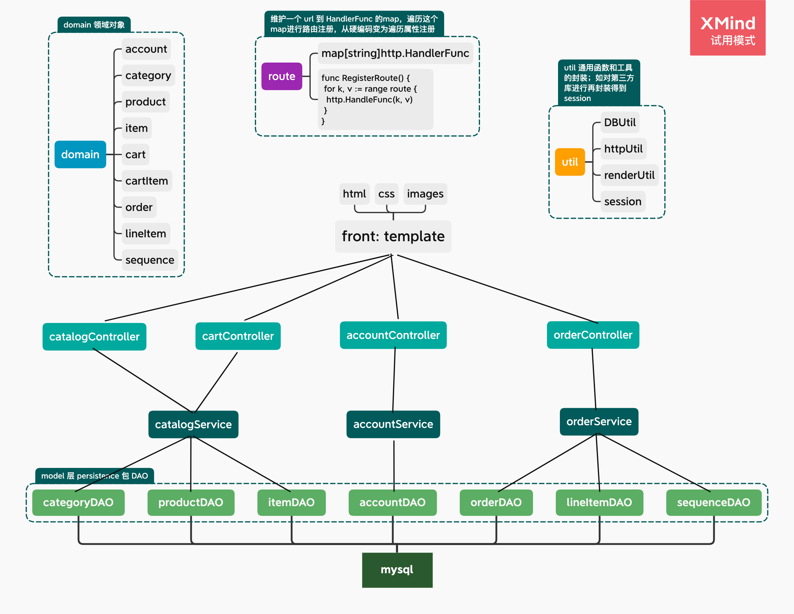

# gopetstore

使用 go语言 实现的 jpetstore

不使用web框架进行整合，旨在上手go web编程

原 java 无框架版：https://github.com/SwordHarry/Jpetstore 

原 java SpringBoot + Mybatis + thyemeleaf版：https://github.com/SwordHarry/mypetstoreSpringBoot

go gin + sqlx 版：https://github.com/SwordHarry/gopetstore_v2

### 业务模块
- 商品模块
    - category
    - product
    - item
    - search
- 购物车模块
    - cart
- 用户模块
    - account
- 订单模块
    - order
    - lineItem
    - sequence

### 架构
template + go + mysql 
**没有使用web框架，围绕 go 标准库http库** 
采用 MVC 分层开发：DAO-persistence、service、controller、template 
使用了 sessions 等第三方库 

by the way，正在这里养成写注释和封装的习惯

